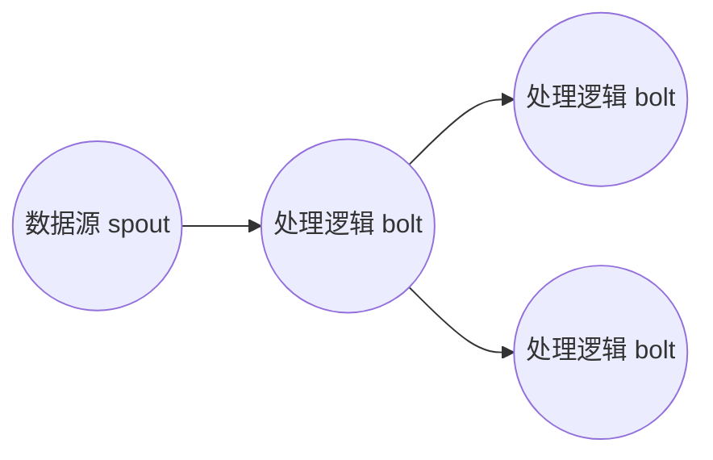
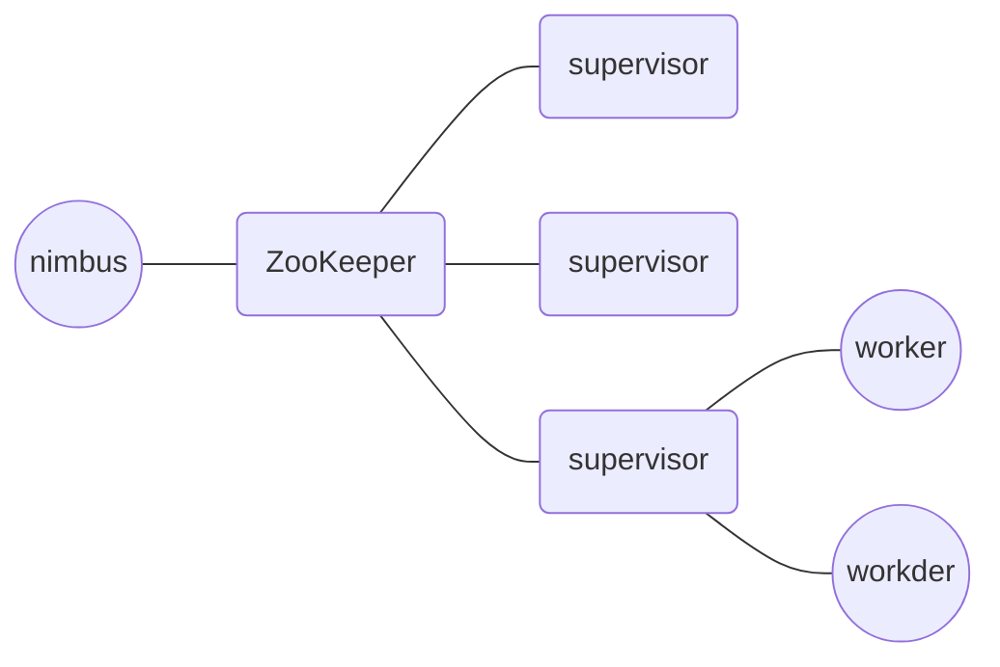
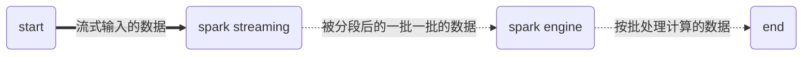

模块二主要讲的是**大数据生态体系主要产品原理与架构**

# Hive 如何让 MapReduce 实现 SQL 操作

Hive 就是一种工具，自动将 SQL 生成 MapReduce 代码，分析师只需要输入 SQL，然后提交给 Hadoop 执行就可以。

Hive 的执行计划是根据 SQL 语句生成这些函数的 DAG （有向无环图），然后封装进 MapReduce 的 map 和 reduce 函数中，Hive 可实现的计算有聚合（group by）、过滤（where）、连接（join）等操作。

大数据 SQL 引擎：
- Impala：运行在 HDFS 上的MPP架构的 SQL 引擎
- Spark SQL

<!--more-->

# Spark 的出现

> 我们常常意识不到问题的存在，直到有人解决了这些问题

- MapReduce：比较注重 map 和 reduce 的输入和输出，可以认为是**面向过程**的大数据开发
- Spark：主要由 RDD 对象，并对这个对象得到一系列的新 RDD 对象，可以理解为是**面向对象**的大数据计算


RDD（Resilient Distributed Datasets）：弹性数据集
- 转换函数（transformation function）: 函数返回值是 RDD
    - map、filter、union、reduceByKey、join、groupByKey等
- 执行函数（action function）：函数不返回 RDD

如何做到既不自以为是，又能逐渐摆脱平庸，进而慢慢向大师靠近？
> 不要直接提出你的问题和方案，直向曲中求，对于复杂的问题，越是直截了当越是得不到答案。

# Spark 为何更加高效
> 移动计算比移动数据更划算，也就是把计算程序发送到分片数据中，而不是把数据发送到程序中 -- 大数据计算的基本原则

Spark 的计算框架更加富有弹性和灵活性体现在：
它可以根据应用的复杂程度，分割成更多的计算阶段（stage），这些计算阶段组成一个有向无环图 DAG，Spark 任务调度器可以根据 DAG 的依赖关系执行计算阶段。

```java
rddB = rddA.groupBy(key)
rddD = rddC.map(func)
rddF = rddD.union(rddE)
rddG = rddB.join(rddF)
```

也就是说 Spark 作业调度执行的核心是 DAG，有了 DAG，整个应用就被切分成哪些阶段，每个阶段的依赖关系也就清楚了。每个阶段都会生成相应的任务集合 （TaskSet），每个任务都分配一个任务进程去处理，Spark 就实现了大数据的分布式计算。


阶段划分是根据是否需要进行 shuffle，也就是在图中是否有交叉。

## Spark 的作业管理

Spark 有三个主要特征：
- RDD 的编程模型更简单
- DAG 切分的多阶段计算过程更快速
- 使用内存存储中间计算结果更高效

这三个特性使得 Spark 相对 Hadoop MapReduce 可以有更快的执行速度，以及更简单的编程实现。

# Big Table 的开源实现：HBase

NoSQL， 主要指非关系的、分布式的、支持海量数据存储的数据库设计模式。其中的代表方案是 HBase。

HBase 的可伸缩架构依赖于：
- 可分裂的 HRegion：负责数据存储的主要进程
- 可伸缩的分布式文件系统 HDFS

HBase 的高性能存储：
- 支持列族存储（Column family），创建表时无需指定字段，实现了数据表结构可以在运行期间自定义
- 使用 LSM 树（Log Structed Merge Tree）的数据结构进行数据存储

LSM 树可以看作是一个 N 阶合并树。数据写操作都在内存中进行，因此可以极大程度地减少磁盘的访问次数，加快访问速度。

# 流式计算的代表：Storm、Flink、Spark Streaming

- 大规模批处理：计算前面的 MapReduce、Spark 等大数据处理框架主要是**处理、计算存储介质上的大规模数据，也叫大规模批处理计算，一般是离线的**
- 大规模流计算系统：还有一种大数据技术，针对实时产生的大规模数据进行即时计算处理，如摄像头采集的实时视频数据、淘宝实时产生的订单数据等。针对这类大数据的实时处理系统叫做**大数据流计算系统**

## Storm
早期对流数据的处理方式是通过串行的消息队列及处理逻辑实现，处理逻辑既消费前面消息队列的数据，也为下一个消息队列产生数据。
这种系统的一个很大的弊端是，无法复用，新的需求都需要重新开发类似的系统。 Storm 应运而生。

应用 Storm 只需要定义好处理流程和每一个节点的处理逻辑，代码部署到流处理系统后，就能按照预定义的处理流程和处理逻辑执行：



如上图中，开发者无需再关注数据的流转、消息的处理和消费，只要编程开发好数据的处理逻辑 bolt 和数据源的逻辑 spolt，以及他们之间的拓扑逻辑关系 toplogy，提交给 Storm 上运行就可以了。

Storm 是主从架构：

其中：
- nimbus：是集群的 Master，负责集群管理、任务分配等
- supervisor：是 Slave，是真正完成计算的地方
- worker：每个 supervisor 启动多个 worker 进程，每个 worker 运行多个 task

## Spark Streaming
Spark 具有**分片**和**快速计算**的特性；Spark Streaming 正是巧妙的利用了该特性，将实时传输进来的数据按照时间进行分段，把一段时间传输进来的数据合并在一起，当做一批数据，再去交给 Spark 去处理。


总结：
Spark Streaming 是将实时数据流**按时间分段**后，当做**小的批处理数据**去计算。

## Flink

Flink 既可以流处理又可以批处理计算。
- 流计算：
当需要进行流计算时，Flink 会初始化一个流执行环境 StreamExecutionEnvironment，然后利用这个执行环境构建数据流 DataStream。
```java
StreamExecutionEnvironment see = StreamExecutionEnvironment.getExecutionEnvironment();

DataStream<WikipediaEditEvent> edits = see.addSource(new WikipediaEditsSource());

```
- 批处理计算：
Flink 会初始化一个批处理执行环境 ExecutionEnvironment，然后利用这个环境构建数据集 DataSet
```java
ExecutionEnvironment env = ExecutionEnvironment.getExecutionEnvironment();

DataSet<String> text = env.readTextFile("/path/to/file");

```
> 计算机软件发展史，是一部**技术和业务不断分离**的历史，人们不断将业务逻辑从技术实现上分离出来，各种技术和架构方案的出现，也基本都是为这一目标服务。

# ZooKeeper 是如何保证数据一致性的

分布式系统的一致性：
- HDFS：为了保证集群的高可用，部署两台 NameNode 服务器，分别为主从服务器，但可能会出现「脑裂」问题，也就是集群对两台主从服务器可用性的判断性不一样

为了解决多台服务器一致性的解决方案就是使用**ZooKeeper**

## Paxos 算法与 ZooKeeper 架构

**Paxos 算法**用来解决分布式系统对数据一致性的要求，它是通过**投票机制**决定一个数据的更新与写入
基于 Paxos 算法，ZooKeeper 简化了实现机制，使用了 ZAB（ZooKeeper Atomic Broadcast）的算法协议，应用该算法，ZooKeeper 集群保证数据更新的一致性，并保证高可用。

大数据系统通常都是主从架构，主服务器管理集群的状态和元信息（meta-info），运行期间只有主服务器工作（active master），必须有另外一个主服务器保持热备（standby master，主用主控，备用主控的区别）

因此大数据系统依赖 ZooKeeper 提供的一致性数据服务，用于选举当前工作的主服务器。

> ZooKeeper 通过 Paxos 选举算法实现数据强一致性，并为各种大数据系统提供主服务器选举服务。

CAP 原则：在一个分布式系统中，Consistency（一致性）、Availability（可用性）、Partition tolerance（分区容错性）三者不可兼得

总结：
**大数据技术产品**
- 大数据计算
    - 大数据批计算
        - MapReduce、Spark
    - 大数据流计算
        - Spark Streaming
        - Flink
        - Storm
    - 大数据仓库
        - Hive
        - Spark SQL
- 大数据资源管理
    - Yarn
- 大数据存储
    - HDFS（大数据分布式文件系统）、HBase（一种 NoSQL 数据库）

> 我只愿蓬勃生活在此时此刻，无所谓去哪，无所谓见谁。那些我将要去的地方，都是我从未谋面的故乡。以前是以前，现在是现在。我不能选择怎么生，怎么死；但我能决定怎么爱，怎么活。 -- 王小波《黄金时代》

# Reference
- [从0开始学大数据](https://time.geekbang.org/column/133)
